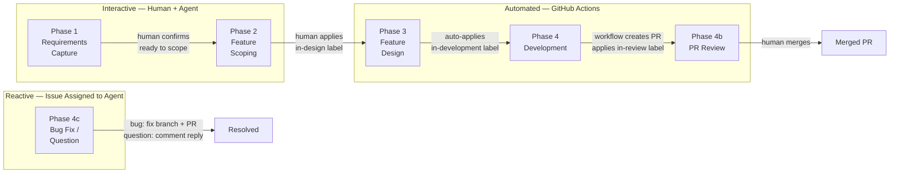
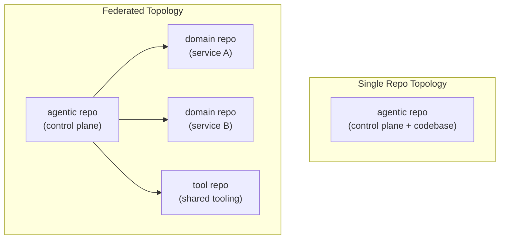

# AI-Native Software Delivery

> An Agentic approach to software development using AI


> [!WARNING]
> **Early development.** This framework is actively evolving — the protocol, skills, and
> tooling are being refined with every project that uses it. Core concepts are stable, but
> breaking changes can and do happen between releases. Always review the release notes before
> syncing `base/` into a project. Feedback, issues, and contributions are very welcome.

---

## The problem

AI coding assistants are powerful — but undisciplined. Left without structure, they
go off-scope, skip tests, invent behaviour, and produce output that is difficult to
review or trace back to a requirement. The bigger the task, the worse the noise.

The solution is not a better prompt. It is a protocol.

This framework gives AI agents a structured, phase-based delivery methodology to follow.
Agents know what phase they are in, what the entry conditions are, what they are allowed
to do, and when to stop and hand back to a human. Every phase produces a concrete GitHub
artefact. Every phase transition is a deliberate human decision.

The result is AI-assisted development that is **traceable, reviewable, and governed** —
without sacrificing the speed that makes agentic tooling worth using.

---

## What this is

An **AI-native software delivery framework** covering the development side of the SDLC:
requirements capture through to a reviewed, mergeable pull request.

It provides:

- A **phase-based delivery protocol** that agents follow consistently across projects and stacks
- **Session types** for each phase — with explicit entry conditions, steps, and exit criteria
- **Skills** — reusable, named procedures agents invoke for specific tasks (see [Skills](#skills))
- **Language-specific coding standards** that govern how agents write, test, and structure code
- **A two-layer configuration model** — global template rules plus project-specific overrides
- **GitHub as the source of truth** — issues track state, branches track work, PRs are the handoff
- **A companion CLI extension** ([gh-agentic](https://github.com/eddiecarpenter/gh-agentic)) that handles deterministic environment setup so agents focus on reasoning

Works with any AI agent CLI that can read a protocol file and execute tools.
The underlying AI model is your choice — OpenAI, Anthropic, Google Gemini, Ollama,
or any other provider supported by your agent runtime.

### Shift left of AI

Traditional "shift left" moves testing and quality earlier in the process.
This framework shifts AI participation left — all the way to requirements.

Most AI coding tools enter the SDLC at implementation time. By that point, the scope
is fixed, the design is decided, and the agent is a code generator. This framework
introduces the agent at Phase 1. It participates in capturing the requirement, scoping
the feature, and designing the solution before a single line of code is written.

The result is that implementation-phase agents work from well-formed, consistently
structured input — user stories with Given/When/Then acceptance criteria, task
sub-issues with clear scope, a feature branch that maps directly to a requirement.
The agent is not guessing at intent; the intent was structured by an earlier agent session.

---

## What this is not

**Not a CI/CD pipeline.**
The framework covers the development process — from requirement to merged PR. Deployment,
environment promotion, and operations are outside its scope. That said, your CD process
is project-specific and belongs in your domain repo. There is nothing stopping you from
using this same framework to design, build, and govern your CD pipeline as a feature of
your project — the protocol applies equally to infrastructure-as-code as it does to
application code.

**Not a fully autonomous system.**
Agents do not proceed without human approval at phase boundaries. A human applies the
label that triggers the next phase. The agent executes; the human decides what comes next.

**Not a replacement for engineering judgment.**
Agents follow the protocol and produce code that passes tests. They flag risks and stop
before touching contracts, public APIs, or core business logic. Architectural decisions,
scope trade-offs, and final PR approval remain with the human.

**Not opinionated about application architecture.**
The protocol is language- and framework-agnostic. Language-specific standards live in
`base/standards/` and govern _how_ code is written — not how applications are structured.

---

## The delivery pipeline



| Phase | Who drives | Input | Output |
|---|---|---|---|
| 1 — Requirements | Human + Agent | Business need | Requirement issue in agentic repo |
| 2 — Scoping | Human + Agent | Requirement issue | Feature issue(s) in domain repo |
| 3 — Design | Agent | Feature issue | Task sub-issues, feature branch |
| 4 — Development | Agent | Task sub-issues | Commits, closed tasks |
| 4b — Review | Agent + Human | PR | Approved, mergeable PR |
| 4c — Issue | Agent | Assigned GitHub issue | Bug fix PR or question answer |

Phases 1 and 2 are conversational — the human drives, the agent captures and structures.
Phases 3 and 4 are automated — triggered by GitHub Actions when a label is applied.
A recovery session handles workflow failures interactively.

### Project board automation

The project board is kept in sync automatically — no manual column moves needed.
Two GitHub Actions workflows handle this:

- **New issue opened** → added to the project board with its initial status column set
  from the pipeline label (`backlog`, `scoping`, etc.)
- **Pipeline label applied** → board status column updated to match

The board columns map directly to pipeline labels: **Backlog**, **Scoping**,
**Scheduled**, **In Design**, **In Development**, **In Review**, **Done**.

This requires the `AGENTIC_PROJECT_ID` repo variable to be set to the GitHub Project's
node ID. If the variable is not set, board sync is silently skipped — the pipeline
still works, the board just won't update automatically.

### Foreground Recovery — the escape hatch

**Foreground Recovery** is the emergency escape hatch for anything the automated
pipeline cannot handle on its own. It is not limited to build failures — it is the
correct response to any blocked or unrecoverable state: workflow never triggered,
merge conflict, silent failure, unexpected environment state, or any other situation
requiring manual intervention.

Run it by opening a Goose session and selecting the **Foreground Recovery** recipe.
The protocol evolves as new failure modes are discovered and handled through it.

### Bug reports and questions

Bugs and questions are first-class citizens in the pipeline, not exceptions to it.

When a GitHub Issue is assigned to the agent user, Phase 4c triggers automatically.
The agent routes by label:

- **`bug`** — locates the problem, verifies the fix is within safe scope, creates a fix
  branch, implements the minimal fix, builds and tests, and exits cleanly. The workflow
  pushes and opens the PR.
- **`question`** — researches the answer in the codebase, posts a detailed reply as a
  comment, and closes the issue. No branch, no PR.
- **anything else** — posts a comment asking for a `bug` or `question` label.

The scope check is strict: only files directly related to the bug are touched. If the
fix requires broader changes, the agent posts a comment and adds a `needs-human` label
rather than proceeding.

> [!IMPORTANT]
> **Security vulnerabilities must not be assigned to the agent user until the vulnerability
> has been disclosed and it is safe to discuss publicly.** The agent posts acknowledgement
> comments immediately on assignment — assigning a security issue before disclosure risks
> making the vulnerability public. Handle security issues through your normal private
> disclosure process first; only assign to the agent once a public fix is appropriate.

---

## Repository topology

The framework supports two deployment topologies:



**Single** — one repo contains both the agentic control plane and the project codebase.
Best for small projects or individual developers.

**Federated** — a dedicated agentic repo acts as the control plane, with separate domain
and tool repos registered in `REPOS.md`. Best for multi-service systems or team environments.

---

## Skills

Skills are reusable, named procedures that agents invoke for specific tasks. They are
distinct from rules: a rule is always active and constrains behaviour; a skill is invoked
explicitly when a particular task needs to be performed.

Examples of built-in skills:
- **`capture-feature`** — the canonical structure for a Feature issue body (user story,
  Given/When/Then acceptance criteria, parent link). Applied every time a feature is scoped.
- **`pr-review-session`** — the procedure an agent follows when a PR review is submitted.
- **`foreground-recovery`** — the diagnostic and recovery process for a failed workflow.
- **`notify-user`** — how and when the agent communicates status back to the human.

Skills live in two places:

| Path | Managed by | Purpose |
|---|---|---|
| `base/skills/` | Template (read-only) | Global skills, available to all projects |
| `skills/` | You | Local skills — project-specific, override base skills of the same name |

### Skills vs rules — when to use which

| | Skills | Rules |
|---|---|---|
| **Where** | `skills/` | `AGENTS.local.md` |
| **When active** | Invoked explicitly for a specific task | Always active, every session |
| **Use for** | Reusable procedures, templates, named workflows | Team conventions, prohibited actions, project-specific standards |
| **Override** | A local skill overrides a base skill of the same filename | Local rules extend global rules in `base/AGENTS.md` |
| **Example** | How to structure a release PR | Never commit directly to `main` |

If you find yourself writing the same instructions in multiple sessions, it belongs in a
skill. If it is a constraint that must always apply, it belongs in `AGENTS.local.md`.

---

## Agent runtimes

The framework is designed for **model independence**. Agent behaviour is governed by the
protocol — `base/AGENTS.md`, skills, and standards files — not by the AI model underneath.
This means you are not locked into a single provider. You can run different runtimes for
different phases, swap models as better options emerge, or migrate to a new provider
without changing your delivery process.

Any agent CLI that can read a protocol file and execute shell tools is compatible.
Two runtimes are currently supported:

### Goose

[Goose](https://block.goose.sh) is an open-source, locally-run AI agent from
[Block](https://block.xyz) (the company behind Square and Cash App). It runs on your
machine, reads the protocol, and executes tools — GitHub CLI, git, build commands —
to carry out each session. Goose supports multiple LLM backends (OpenAI, Anthropic,
Google Gemini, Ollama, and others), so you can choose or change the underlying model
without changing the protocol.

Goose has native support for [Claude Code](https://claude.ai/code) as a provider and
recommends it as the default. This gives you Anthropic's reasoning capability through
a familiar, well-supported interface — while keeping the option to switch to any other
provider without touching the framework.

Goose covers the entire delivery pipeline. Recipes exist for every session type —
including the interactive phases (Requirements and Scoping) — so the full process from
first conversation to merged PR can be driven from Goose alone. For automated phases
(3, 4, 4b, 4c), GitHub Actions triggers Goose with the appropriate recipe. For
interactive phases (1 and 2), you run Goose directly in your terminal.

Install: [block.goose.sh](https://block.goose.sh)

### Claude Code *(optional)*

[Claude Code](https://claude.ai/code) is Anthropic's agentic coding CLI and the
recommended default provider within Goose. It can also be used as a standalone runtime
for interactive sessions (Phases 1, 2, and foreground recovery) if you prefer to work
directly in the Claude Code environment. Since Goose covers the full pipeline, using
Claude Code standalone is entirely optional.

Install: [claude.ai/code](https://claude.ai/code)

---

## Companion tool — gh-agentic

[`gh-agentic`](https://github.com/eddiecarpenter/gh-agentic) is a GitHub CLI extension
that handles deterministic environment operations — repo creation, branch protection,
label setup, and scaffolding — as reliable Go code rather than agent-executed shell commands.

```bash
gh extension install eddiecarpenter/gh-agentic
```

| Command | What it does |
|---|---|
| `gh agentic bootstrap` | Creates and configures a new agentic environment (Phase 0a) |
| `gh agentic inception` | Adds a new domain or tool repo to an existing environment (Phase 0b) |
| `gh agentic sync` | Syncs `base/` from the upstream template |
| `gh agentic verify` | Detects local drift in template-managed files |

The separation between `gh-agentic` and this repo is a GitHub CLI constraint — extensions
must be named `gh-*` and live in their own repo. Conceptually they are one system.

---

## Getting started

### Prerequisites

- [git](https://git-scm.com)
- [GitHub CLI](https://cli.github.com) — authenticated (`gh auth login`)
- A GitHub Personal Access Token (PAT) with `repo`, `workflow`, and `admin:org` scopes
- [Goose](https://block.goose.sh) — the primary agent runtime
- An LLM backend configured in Goose (OpenAI, Anthropic, Google Gemini, Ollama, or any other supported provider)
- [Claude Code](https://claude.ai/code) *(optional, recommended)* — for interactive sessions

### Bootstrap a new environment

Navigate to the folder where you want the new agentic repo to be created:

```bash
cd ~/Development/my-projects
```

Download and run the bootstrap script:

```bash
curl -fsSL https://raw.githubusercontent.com/eddiecarpenter/ai-native-delivery/main/bootstrap.sh -o /tmp/bootstrap.sh \
  && bash /tmp/bootstrap.sh
```

> **Tip:** Inspect the script before running it:
> ```bash
> curl -fsSL https://raw.githubusercontent.com/eddiecarpenter/ai-native-delivery/main/bootstrap.sh | less
> ```

> **Optional — verify script integrity before running:**
> ```bash
> curl -fsSL https://raw.githubusercontent.com/eddiecarpenter/ai-native-delivery/main/bootstrap.sh -o /tmp/bootstrap.sh \
>   && curl -fsSL https://raw.githubusercontent.com/eddiecarpenter/ai-native-delivery/main/bootstrap.sh.md5 -o /tmp/bootstrap.sh.md5 \
>   && (cd /tmp && md5sum -c bootstrap.sh.md5) \
>   && bash /tmp/bootstrap.sh
> ```

> **Note:** There will be a short pause after the agent launches while it reads
> the protocol from the template — this is expected.

The script will:
1. Verify prerequisites are in place
2. Ask whether to use Goose or Claude Code
3. Launch the Phase 0a Environment Bootstrap Session
4. Guide you through creating and configuring your new agentic environment
5. Clone the new agentic repo into your current directory

Once complete, open the new agentic repo in your agent and start a Requirements Session (Phase 1).

---

## Extending the framework

### Adding local rules

Project-specific rules belong in `AGENTS.local.md`. These are always active — every
agent session in the repo reads this file. Use rules for:

- Team conventions (branching strategy, commit message format)
- Prohibited actions (never modify this config file, always ask before adding dependencies)
- Project-specific standards (logging patterns, error handling conventions)
- Always-on context (links to external systems, domain glossary)

Rules extend the global protocol in `base/AGENTS.md`. Local rules take precedence where
they conflict.

### Adding local skills

Project-specific skills belong in `skills/`. A local skill with the same filename as a
base skill overrides it. Use skills for:

- Project-specific procedures (your release process, your deployment checklist)
- Templates the agent fills in repeatedly (ADR format, runbook structure)
- Named workflows that are invoked on demand, not always active

```
skills/
  release.md          # overrides or extends base release behaviour
  deployment.md       # your project's CD handoff process
  runbook.md          # template for incident runbooks
```

---

## Using this as your own template

1. Fork this repo to your own GitHub account or organisation
2. Update `TEMPLATE_SOURCE` to point to your fork
3. Mark your fork as a GitHub template repo (Settings → Template repository)
4. Update the bootstrap URL in your fork's `README.md` to point to your fork

> All projects bootstrapped from your fork will sync `base/` from your fork, not from this repo.

---

## Repository layout

| Path | Purpose |
|---|---|
| `base/AGENTS.md` | Global agent protocol — session types, git rules, testing, contracts |
| `base/standards/` | Language-specific coding standards (Go, Java, TypeScript, etc.) |
| `base/skills/` | Built-in skills — managed by template, do not edit |
| `.goose/recipes/` | Agent session recipes (YAML) — managed by template, do not edit |
| `.github/workflows/` | Reusable GitHub Actions workflow definitions |
| `CLAUDE.md` | Entry point — loads `base/AGENTS.md` and `AGENTS.local.md` |
| `AGENTS.local.md` | Local rules — project-specific, never overwritten by sync |
| `REPOS.md` | Repository registry — all domains, tools, and other repos in the project |
| `skills/` | Local skills — project-specific, override base skills of the same name |
| `TEMPLATE_SOURCE` | Records which template repo this environment was bootstrapped from |
| `TEMPLATE_VERSION` | Records the template version last synced |

---

## Syncing updates from the template

Syncing is handled by the agent — do not do this manually.

1. Open an agent session in your agentic repo root
2. Say: *"Sync template"*
3. The agent checks for updates, shows you a diff, and asks for confirmation
4. Review the changes and confirm — the agent commits and cleans up

Only `base/` and `TEMPLATE_VERSION` are ever updated by a sync.
All local files (`AGENTS.local.md`, `REPOS.md`, `CLAUDE.md`, `skills/`, etc.) are never touched.

---

## Releasing a new version

```bash
gh release create vX.Y.Z --generate-notes --target main
```

GitHub automatically generates release notes from merged PRs since the last tag.
Use [semantic versioning](https://semver.org): `fix:` → patch, `feat:` → minor, breaking change → major.

> Releasing is a deliberate human action. Not every merge needs a release —
> batch related changes into a meaningful version.

---

## Built with this framework

This framework is self-hosting — both of these repos were developed using the
AI-Native Software Delivery protocol itself:

| Repo | Description |
|---|---|
| [eddiecarpenter/ai-native-delivery](https://github.com/eddiecarpenter/ai-native-delivery) | This repo — the framework and template |
| [eddiecarpenter/gh-agentic](https://github.com/eddiecarpenter/gh-agentic) | The companion GitHub CLI extension |

---

## Join the journey

This methodology is in its early stages and the best ideas will come from people using it
on real projects. If you are experimenting with agentic development, have hit a wall the
protocol does not handle well, or have a better way to structure something — open an issue
or start a discussion. This is a living framework and every real-world use case makes it
better.

Ways to get involved:

- **Try it** — bootstrap an environment and run a feature through the pipeline
- **Report gaps** — open an issue describing where the protocol broke down or fell short
- **Propose improvements** — suggest changes to `base/AGENTS.md`, a standards file, or a skill
- **Share your stack** — if you add standards for a language or framework not yet covered, a PR is welcome
- **Discuss** — use [GitHub Discussions](https://github.com/eddiecarpenter/ai-native-delivery/discussions) for questions, ideas, and war stories

---

## Disclaimer

This framework is a tool, not a guarantee. AI models make mistakes — they can misread
requirements, produce incorrect code, and miss edge cases. No protocol eliminates that
risk entirely; it reduces and governs it.

**This framework is an aid to software development, not a replacement for developers.**
Every artefact the agent produces — requirements, features, code, tests — must be reviewed
by a qualified engineer before it is acted upon or merged. The human remains responsible
for the quality, correctness, and fitness-for-purpose of the delivered software.

The authors of this framework accept no liability for defects, losses, or damages arising
from software developed with its assistance. Use it with the same professional judgment
you would apply to any tool.

---

## About

This project is maintained by [@eddiecarpenter](https://github.com/eddiecarpenter).
